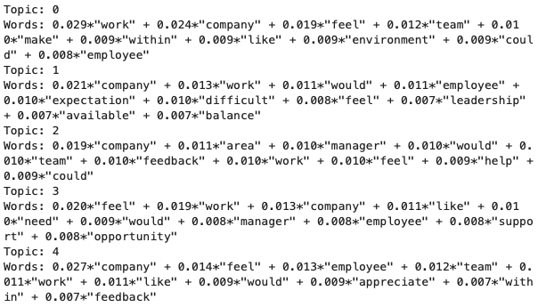
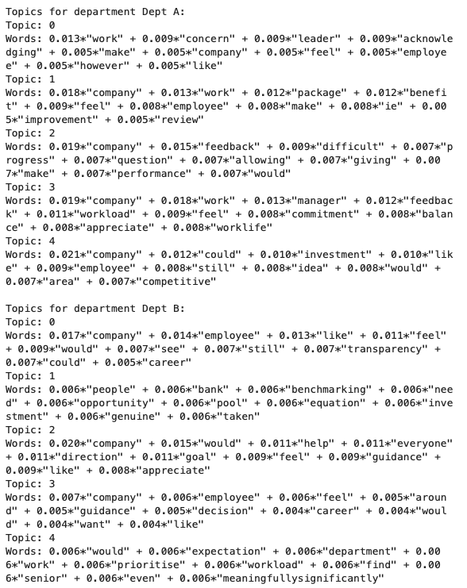
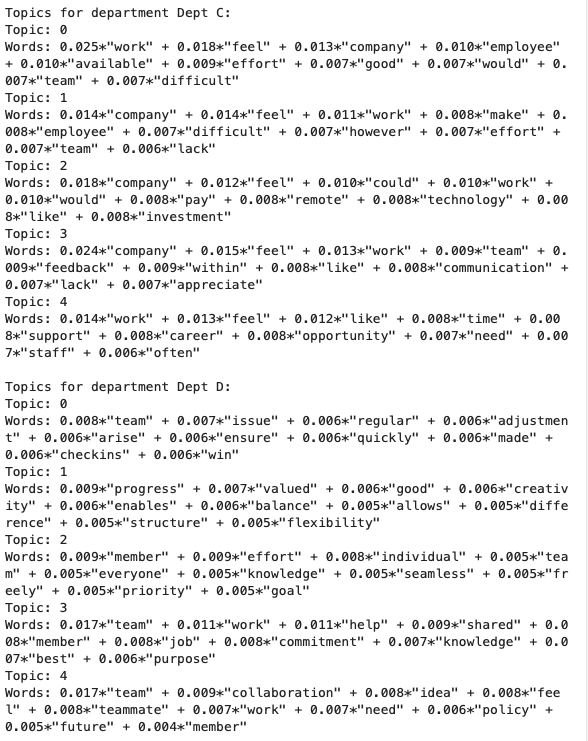
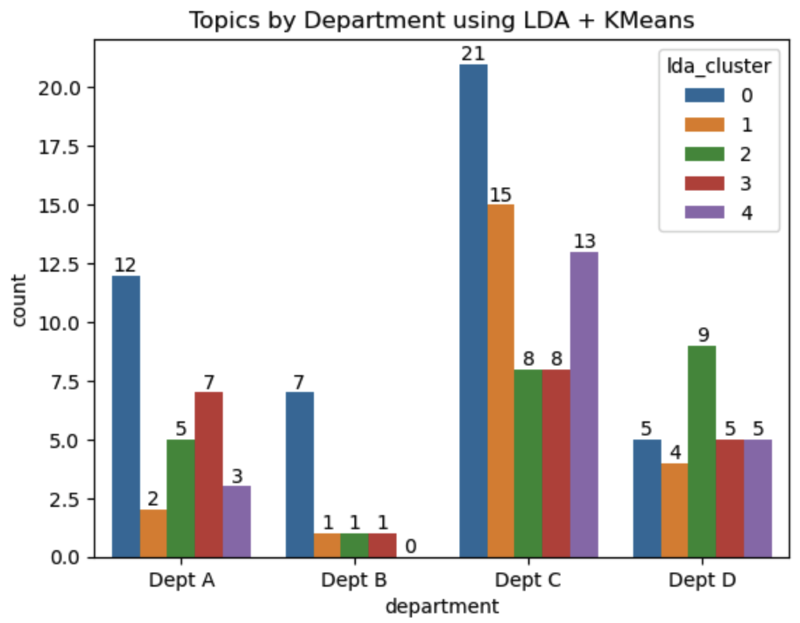
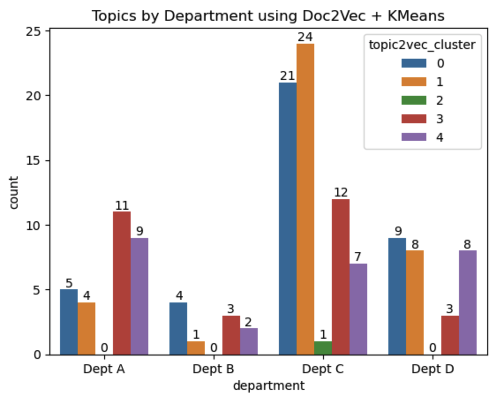
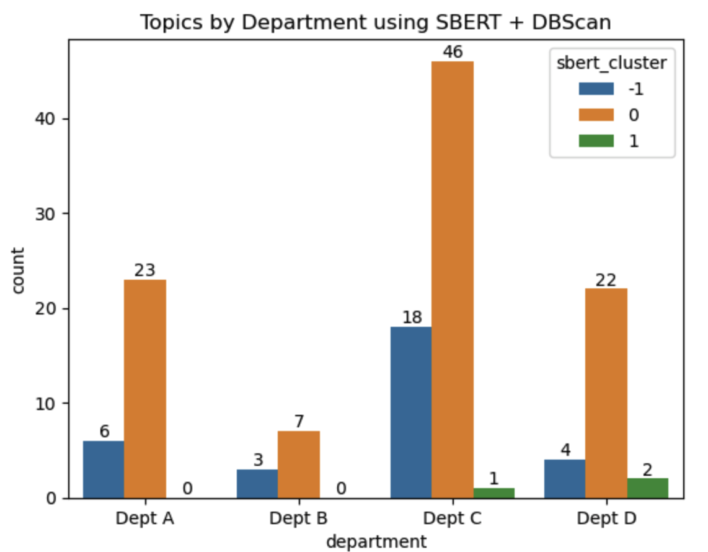
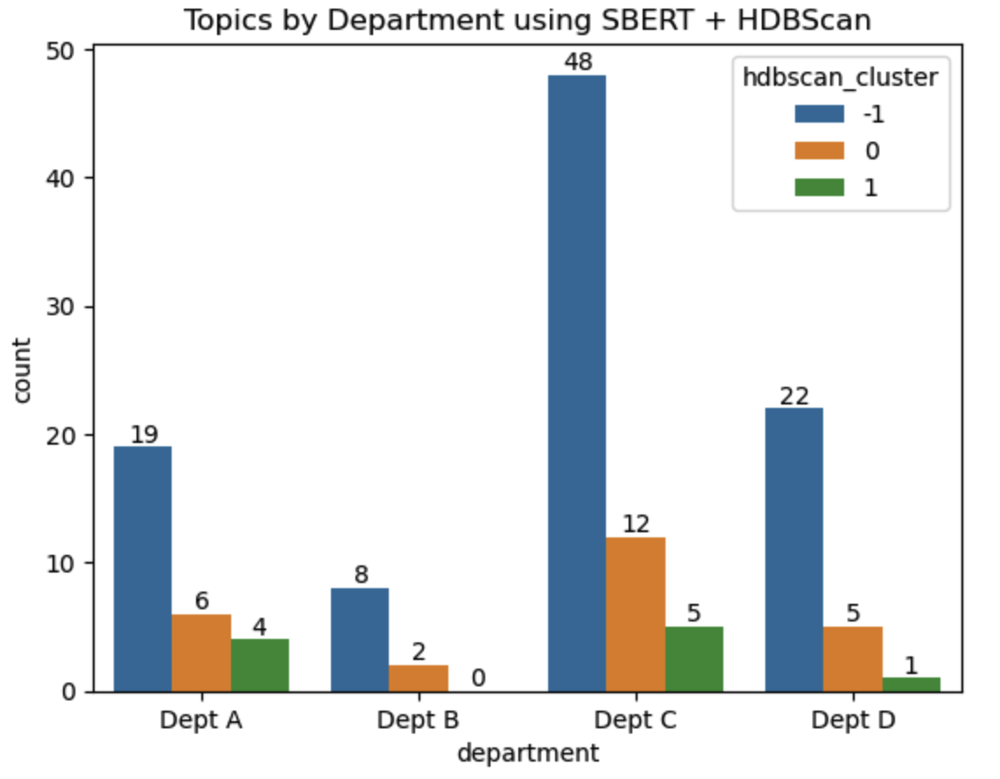

Topic Review Extraction - HR
==============================

Author: Santosh Yadaw | [LinkedIn](https://www.linkedin.com/in/santosh-yadaw-b32025111/) | [Github](https://github.com/SantoshYadaw/)

Overview
------------

In this project, we aim to train a model to extract common themes/reviews from a review data set

Project Organization
------------

    ├── README.md          <- The top-level README for developers using this project.
    ├── data
    │   ├── interim        <- Intermediate data that has been transformed.
    │   ├── processed      <- The final, canonical data sets for modeling.
    │   └── raw            <- The original, immutable data dump.
    │    │
    ├── models             <- Trained and serialized models, model predictions, or model summaries
    │
    ├── notebooks          <- Jupyter notebooks. 
    │
    ├── setup.yml   <- The requirements file for reproducing the analysis environment
    │
    ├── src                <- Source code for use in this project.
    │   ├── __init__.py    <- Makes src a Python module
    │   │
    │   ├── data           <- Scripts to download or generate data
    │   │   └── make_dataset.py
    │   │
    │   ├── models         <- Scripts to train models and then use trained models to make
    │   │   │                 predictions
    │   │   ├── predict_model.py
    │   │   └── train_model.py
    │   │

--------

Environment Setup
------------
1. Build the necessary environment to run the code
```conda env create -f setup.yml```

2. Ensure your have downloaded the dataset from the repo and it is placed under data > raw folder.
--------

Usage via Notebook
------------
Run the notebooks in the order below to perform EDA and Topic Modeling

1. [01_eda.ipynb](notebooks/01_eda.ipynb)
2. [02_topic_model.ipynb](notebooks/02_topic_model.ipynb)


Exploratory Data Analysis
------------

Exploratory Data Analysis notebook can be found in [01_eda.ipynb](notebooks/01_eda.ipynb). Please refer to the notebook for the details.


Topic Modeling Approachs
-----------

More in-depth analysis of the performance can be found in [02_topic_model.ipynb](notebooks/02_topic_model.ipynb).

In this notebook, 3 methods were explored for topic modeling:

1. Latent Dirichlet Allocation (LDA) is a popular method for topic modeling. This helps identify overarching topics in the collection of documents. It is an generative probablistic model that assumes document is a mixture of topics and each topic is a miture of words.

(i) How does LDA work?
a. Generative Process: Assumes documents are producted in the following way:
- Choose a distribution over topics
- For each word in the document:
    - Choose a topic from the distribution
    - Choose a word from the topic
  
b. In the context of LDA, a topic is essentially a distribution over the entire fixed vocabularly. Each word has a certain probability associated with it for that topic

(ii) Topics generated from all responses

<p align="center">
  
  <br>                  
</p>

Topic 0:
- Words: feel, work, team, like, would, still, make, help, company and manager
- Potential Interpretation: This topic seems to appear to be about dfeedback and opportunities within the company. Employees might be discussing about the feedback process, potential groiwth and development opportunities and how they feel about these processes.

Topic 1:
- Words: work, company, feel, feedback, like, opportunity, process, make , employee and would
- Potential Interpretation: This topic leans sentiments about the companieis processes and feedback mechanisms. Feelings and opinions about working in the company and the opportunities (or lack thereof) available to the employees.

Topic 2:
- Words: work, team, career, employeee, communication, make, within, difficult, respected, leadership
- Potential Interpretation: This topic emphasizes on the concerns or comments about career growth and opportunities within the team. Challenges in communication, possible with leadership and how respected or valued the employees feel

Topic 3:
- Words: company, employee, feel, team, however, work, job, would, good and lack

- Potential Interpretation: This topic seems to have a contrasting sentiment where there are some good and some lacking aspects to the job -> keyword is however

Topic 4:
- Words: company, work, feel, feedback, would, employee, manager, like, appreciate and worklife

- Potential Interpretation: This topic suggests recognition and appreciation within the company. The term "appreciate" stands out, implying that employees are talking about recognition or the lack of it. "Feedback" and "team" further reinforce the theme of team dynamics and recognition.

Overall Takeaways:

1. Employee sentiment ("feel", "like") is a recurring theme across multiple topics, indicating it's a significant aspect of the survey responses.
2. The company's environment, expectations, feedback mechanisms, managerial interactions, and recognition are primary concerns or discussion areas among employees.

While the LDA model provides these groupings, it's essential to delve deeper into the actual responses to understand context and nuances. Moreover, combining this quantitative topic modeling with qualitative analyses can give a comprehensive view of the employee sentiment.
Remember, while the topics generated by LDA provide valuable insight, they should be treated as starting points. The actual survey responses, combined with domain knowledge and further qualitative analysis, will yield the most comprehensive insights.

(iii) Topics generated from all responses by department
<p align="center">
  
  <br>                  
</p>

<p align="center">
  
  <br>                  
</p>

<p align="center">
  
  <br>                  
</p>

Interpreting the topics produced by LDA model in the context of different departments can provide insights about the sentiments and concerns , and themes particular to each deparment

Department: Dept A

Topic 0: Concerns about leadership acknowledging employees' efforts and concerns. Sentiments about how employees feel in the work environment.

Topic 1: A focus on the benefits and packages offered by the company. Possible feedback about compensation and areas of improvement.

Topic 2: Feedback about company performance reviews. There might be challenges in getting or giving feedback, and there could be concerns about progress and performance evaluations.

Topic 3: Workload balance and work-life balance seem to be of importance. There's appreciation for some aspects, but feedback about managers might also be significant.

Topic 4: Discussions about the company's investments in certain areas and how competitive they are. A hint at potential suggestions or areas of improvement.

Department: Dept B

- Topic 0: Sentiments about transparency within the company. Employees may want to see more openness, possibly in decision-making or communication.

- Topic 1: Diverse set of terms hinting at benchmarking, investment opportunities, and how genuinely feedback or concerns are taken.

- Topic 2: The emphasis on company direction, goals, and guidance. There's an underlying sentiment of appreciation but possibly a desire for clearer guidance and direction.

- Topic 3 & 4: Feelings about workload and priorities. There might be sentiments about expectations versus reality and a need for senior management to understand and adjust workloads meaningfully.

3. Department: Dept C

- Topic 0: The challenges of work, possibly due to lack of availability of resources or support. There's a sense of effort being put in, but conditions might be difficult.

- Topic 1: Sentiments echoing Topic 0, but with more emphasis on the lack of certain aspects in the work environment.

- Topic 2: Discussions about remote work, technology investments, and possible suggestions for improvements.

- Topic 3: Feedback about communication within the team or department. 
Appreciation for some aspects, but there could be a sense of lack in others.

- Topic 4: Emphasis on career opportunities, support, and the need for certain aspects in the workplace.

4. Department: Dept D

- Topic 0: The importance of regular check-ins and adjustments in the team. Proactive measures to address issues as they arise.

- Topic 1: Positive sentiments about work flexibility, balance, and the value of creativity in the department.

- Topic 2: The seamless effort of team members and the prioritization of goals.

- Topic 3: The emphasis on shared knowledge, commitment, and the collective purpose of the team.

- Topic 4: Collaboration and ideas within the team. Sentiments about how teammates feel and potential suggestions or feedback about policies.

General Notes:
- Each Department's Emphasis: Different departments seem to have different areas of emphasis. Dept A focuses on leadership and benefits, Dept B on transparency and direction, Dept C on work challenges and technology, and Dept D on teamwork and collaboration.

- Common Themes: Themes like "work," "feel," and "company" are recurrent, hinting at universal sentiments about the workplace and company culture.

2. Embedding based Approaches + Clustering: The idea here is to try different embedding based model to convert the employee feedback into embeddings and then try to cluster them using different clustering algorithms. The underlying assumption here is that employee feedbacks which are similar in the embedding space will belong to a specific topic. This method would produce better results over LDA since it can help to preserve the semantic and syntactic meaning instead of using the traditional BOW approach. 

2b. Doc2Vec + Kmeans - Convert documents to embeddings via Doc2Vec model. Clusters are form via Kmeans - documents with underlying similarity are likely similar documents/topics.

<p align="center">
  
  <br>                  
</p>

2c. SBert + DBScan - Convert documents to embeddings via SBERT model. Clusters are form via DBScan (Density-Based Spatial Clustering of Applications with Noise - density based cluster technique that groups data points based on their density and proximity to each other) - documents with underlying similarity are likely similar documents/topics.

Why use DBScan?
- Groups 'densely grouped' data points into a single cluster
- Identifies clusters in large spatial datasets by looking at the local density of the data points
- Robust to outliers 
- Does not require us to specify the number of clusters beforehand like K-Means

<p align="center">
  
  <br>                  
</p>

2d. SBert + HDBScan - Convert documents to embeddings via SBERT model.Clusters are form via HDBScan (Hierarchical Density-Based Spatial Clustering of Applications with Noise - density based cluster technique that groups data points based on their density and proximity to each other and over varying epsilon values and integrates the results tgo fgind the cluster that gives the best stability over epsilon) - documents with underlying similarity are likely similar documents/topics.

Why use HDBScan?
- More robust to varying DBScan
- Good clustering out of the box without miuch parameter tuning
- Robust to outliers 
- Does not require us to specify the number of clusters beforehand like K-Means

<p align="center">
  
  <br>                  
</p>

Future Work
------------

References
------------